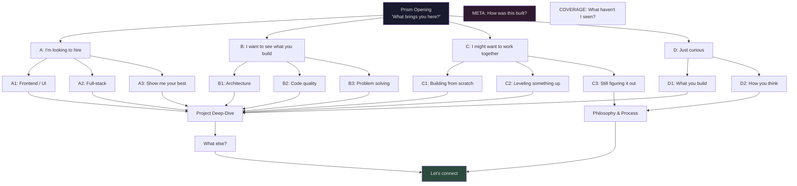
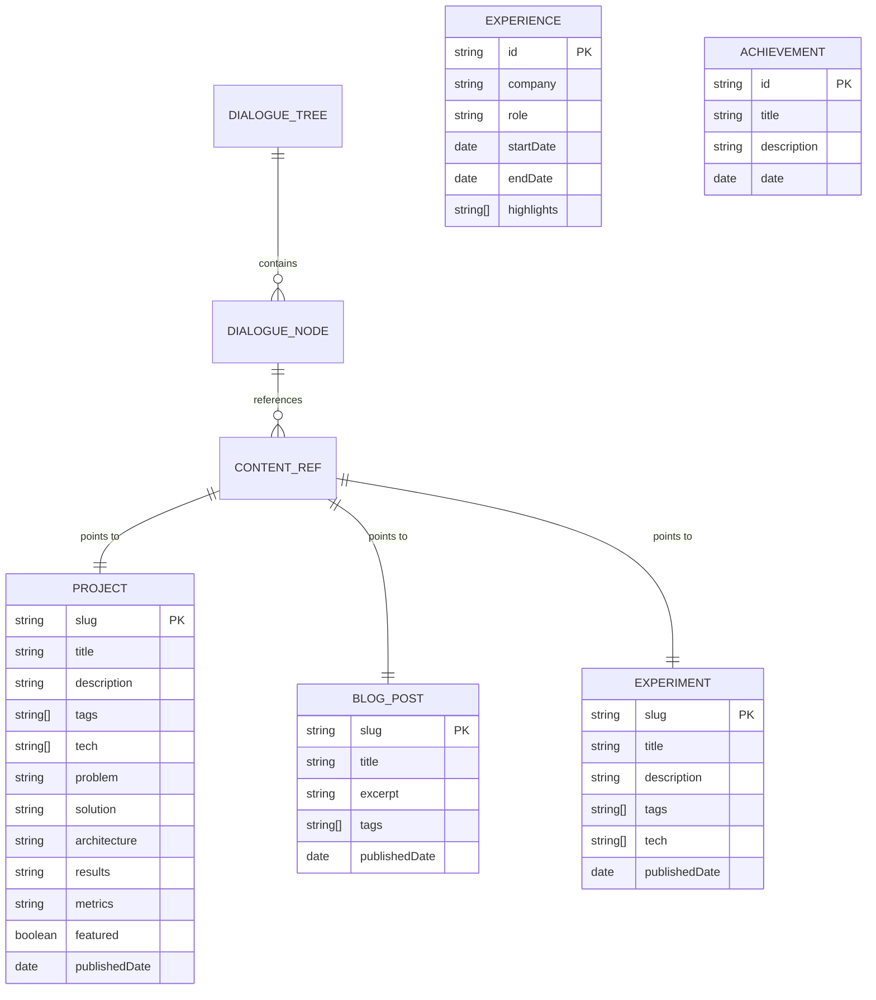

# Deliverables 4–8: Storytelling, Journey, Architecture & Wireframes

---

## Deliverable 4: Storytelling Model

### 4.1 The Narrative Premise

The Dialogue inverts the fundamental power dynamic of a portfolio. Instead of the developer broadcasting at the visitor, the portfolio **listens first**. It asks what the visitor needs, then shapes itself around that need.

The story being told is not "here is my work" — it is "your time matters, so let me show you exactly what's relevant to you." This framing itself communicates the developer's core values: empathy, efficiency, product thinking, and respect for the user.

**Narrative structure**: Branching dialogue with convergent endings. Every path leads to the same destination (contact/connection) but takes a different route through the content. The structure mirrors good product design — multiple entry points, one clear call to action.

---

### 4.2 The Voice

The portfolio speaks in **first person**. It is the developer — but a curated, confident, slightly self-aware version. The voice has rules:

| Trait | Expression | Example |
|-------|-----------|---------|
| **Confident** | States facts, doesn't hedge | "This is my strongest project." not "I think this might be good." |
| **Witty** | Dry, understated humor — never forced | "You could read my résumé. But we both know that's not why you're here." |
| **Warm** | Genuine, not performative | "Thanks for sticking around. Here's something most visitors don't see." |
| **Direct** | No filler, no fluff | "Three projects. Each one solved a real problem." |
| **Self-aware** | Knows it's a portfolio, doesn't pretend otherwise | "Yes, this is a portfolio. No, it's not a typical one. Let me explain." |
| **Never arrogant** | Lets work speak for itself | Shows metrics, never says "I'm the best" |
| **Never generic** | Every line is specific | No "passionate developer" or "innovative solutions" |

**Voice constraint**: Every line of dialogue must pass the "would I say this out loud?" test. If it sounds like marketing copy, rewrite it.

---

### 4.3 The Opening: The Prism Moment

**Duration**: 3–5 seconds (faster on return visits)

**Sequence**:

```
Frame 1 (0s): Black screen. A crystalline prism fades in, center-screen.
             Ambient undercurrent begins as subtle, neutral-tone noise.
             
Frame 2 (1.5s): Text appears above prism:
             "[REPLACE: Developer's full name]"
             Set in display serif, medium weight, generous tracking.

Frame 3 (2.5s): Below the name:
             "This isn't a typical portfolio."
             Slightly smaller, same typeface, lighter weight.

Frame 4 (3.5s): The prism begins to subtly rotate/catch light.
             Below the previous text:
             "It's a conversation."
             
Frame 5 (4.5s): Four choice blocks fade in below:
             ┌─────────────────────────────────┐
             │  "I'm looking to hire someone"   │
             │  "I want to see what you build"  │
             │  "I might want to work together" │
             │  "Just curious"                  │
             └─────────────────────────────────┘
             
             Each block: geometric sans, right-aligned,
             subtle left border that glows on hover/focus.
```

**On first choice**: A beam of light enters the prism and refracts into the color spectrum associated with the chosen path. The prism gracefully exits (scales down + fades). The split-screen dialogue layout slides in. The ambient undercurrent transitions to the path's color.

**Mobile**: Prism is CSS gradient animation (refraction shimmer). Same text sequence. Choices are full-width tap targets.

**Reduced motion**: All transitions are instant cuts. Prism is static. Text appears without animation.

**Return visitor**: Prism is skipped. Instead:
```
"Welcome back. Last time you explored [REPLACE: last topic visited].
 Pick up there, or start fresh?"
 
 ┌────────────────────────────────┐
 │  "Continue where I left off"   │
 │  "Start fresh"                 │
 └────────────────────────────────┘
```

---

### 4.4 The Complete Dialogue Tree

> [!NOTE]
> All dialogue text marked `[REPLACE: ...]` is placeholder content that will be replaced with the developer's actual voice and content. The **structure** is final; the **words** are drafts.

#### Tree Architecture



#### Branch A: Recruiter Path — "I'm looking to hire someone"

**Design goal**: Value in under 30 seconds. Three clicks to the best work.

```
PORTFOLIO: "Good timing."
           "What kind of role are you filling?"

├── A1: "Frontend / UI Engineering"
│   
│   PORTFOLIO: "That's where I'm sharpest."
│              "[REPLACE: One-sentence frontend philosophy]"
│              "Here are three projects where the interface was everything:"
│   
│   → [ProjectShowcase: filtered by tag "frontend", limit 3]
│   
│   Each project shows: title, one-line description, key tech, 
│   hero screenshot. Clicking expands to full case study.
│   
│   AFTER PROJECTS:
│   PORTFOLIO: "Those are the highlights. Want more depth?"
│   ├── "Show me how you approach a problem" → B3 (Problem Solving)
│   ├── "I'd like to see code quality" → B2 (Code Quality)
│   └── "I've seen enough — let's talk" → CONTACT
│
├── A2: "Full-stack / Generalist"
│   
│   PORTFOLIO: "I build end to end."
│              "[REPLACE: One-sentence fullstack philosophy]"
│              "Here's what that looks like:"
│   
│   → [ProjectShowcase: filtered by tag "fullstack", limit 3]
│   
│   AFTER PROJECTS:
│   PORTFOLIO: "Anything catch your eye?"
│   ├── "Tell me about the architecture" → B1 (Architecture)
│   ├── "What's the hardest thing you've built?" → B3 (Problem Solving)  
│   └── "Let's connect" → CONTACT
│
└── A3: "Just show me your best work"
    
    PORTFOLIO: "Gladly. These three — and why they matter."
    
    → [ProjectShowcase: filtered by featured=true, limit 3,
       includes personal commentary per project]
    
    AFTER PROJECTS:
    PORTFOLIO: "That's the short version. Want the long one?"
    ├── "Go deeper on [Project 1]" → CaseStudy(project1)
    ├── "Go deeper on [Project 2]" → CaseStudy(project2)
    ├── "Go deeper on [Project 3]" → CaseStudy(project3)
    └── "Let's talk" → CONTACT
```

#### Branch B: CTO Path — "I want to see what you build"

**Design goal**: Demonstrate engineering judgment in 2 minutes.

```
PORTFOLIO: "Let's skip the surface."
           "Pick your lens:"

├── B1: "Architecture & Systems"
│   
│   PORTFOLIO: "[REPLACE: Architecture philosophy — 2 sentences]"
│              "Let me show you how I think about systems."
│   
│   → [ProjectShowcase: architecture-focused view]
│   Each project shows: architecture diagram, tech decisions table,
│   tradeoff analysis, scale/performance metrics.
│   
│   AFTER:
│   PORTFOLIO: "Questions I had to answer on these projects:"
│   → [DecisionLog: key architectural decisions with context]
│   ├── "Show me the code" → B2
│   ├── "How do you handle failure?" → B3
│   └── "Impressive — let's talk" → CONTACT
│
├── B2: "Code Quality & Craft"
│   
│   PORTFOLIO: "[REPLACE: Code quality philosophy — 2 sentences]"
│   
│   → [CodeShowcase: annotated code examples from real projects]
│   → [EngineeringPractices: testing, CI/CD, documentation approach]
│   
│   AFTER:
│   ├── "Show me a hard problem you solved" → B3
│   └── "Let's connect" → CONTACT
│
└── B3: "How I Solve Hard Problems"
    
    PORTFOLIO: "Every project has a moment where the obvious approach fails."
               "Here are mine."
    
    → [ChallengeNarratives: 2-3 stories structured as]
       Problem → First Attempt → Why It Failed → Insight → Solution → Result
    
    AFTER:
    PORTFOLIO: "That's how I work. Still interested?"
    └── "Let's talk" → CONTACT
```

#### Branch C: Founder Path — "I might want to work together"

**Design goal**: Build trust and demonstrate adaptability in 5 minutes.

```
PORTFOLIO: "I like that 'might.' Let me help you decide."
           "What stage are you at?"

├── C1: "Building something from scratch"
│   
│   PORTFOLIO: "[REPLACE: Zero-to-one philosophy]"
│              "I've taken ideas from napkin to production. Here's how:"
│   
│   → [ProjectShowcase: MVP/greenfield projects]
│   → [ProcessDescription: how I work on new projects]
│   
│   AFTER:
│   PORTFOLIO: "Here's what working with me looks like:"
│   → [Workflow: communication, iteration, delivery cadence]
│   └── "Let's talk about your project" → CONTACT (with context)
│
├── C2: "Leveling something up"
│   
│   PORTFOLIO: "Making good things great. That's where the craft is."
│   
│   → [ProjectShowcase: improvement/refactor/scale projects]
│   → [MetricsComparison: before/after for each]
│   
│   AFTER:
│   └── "Tell me about your project" → CONTACT (with context)
│
└── C3: "Still figuring it out"
    
    PORTFOLIO: "No pressure. Let me show you the range."
    → Lighter-touch showcase of all project types
    → Ends with: "When the timing's right, I'm here."
    └── CONTACT (soft CTA)
```

#### Branch D: Explorer Path — "Just curious"

**Design goal**: Full, narrative-rich experience in 3–5 minutes.

```
PORTFOLIO: "Welcome. This is the scenic route."
           "[REPLACE: name]. [REPLACE: one-sentence identity]."
           
           "What's more interesting to you —
            what I build, or how I think?"

├── D1: "What you build"
│   
│   PORTFOLIO: "[REPLACE: Work philosophy — 2 sentences]"
│              "Let me walk you through the highlights."
│   
│   → [ProjectShowcase: all featured projects, chronological]
│   Interspersed with personal commentary:
│   "This one taught me [REPLACE: lesson]."
│   "I'm proudest of this because [REPLACE: reason]."
│   
│   AFTER PROJECTS:
│   PORTFOLIO: "That's the work. Want to know the person behind it?"
│   ├── "Tell me more" → D2 (How you think)
│   ├── "How was this portfolio built?" → META
│   └── "I've seen enough — let's connect" → CONTACT
│
└── D2: "How you think"
    
    PORTFOLIO: "[REPLACE: Personal philosophy — paragraph]"
    
    → [PhilosophyBlocks: 3-4 core beliefs with project evidence]
    Example structure:
    "I believe [REPLACE: principle]."
    "Here's a project where that mattered:" → project link
    
    AFTER:
    PORTFOLIO: "That's how I see things. Resonates?"
    ├── "Show me the work" → D1
    ├── "This portfolio is interesting — how'd you build it?" → META
    └── "Let's connect" → CONTACT
```

#### Cross-Cutting Nodes

**META Node** — accessible from persistent navigation at all times:

```
PORTFOLIO: "You're asking about the portfolio itself. I like that."
           
           "This site is a conversation — not because chatbots are trendy,
            but because your time deserves better than a generic scroll."
           
           [REPLACE: Tech stack description]
           [REPLACE: Key architectural decisions]
           [REPLACE: What made it hard]
           [REPLACE: What I learned building it]
           
           "The source code is here: [REPLACE: GitHub link]"
```

**CONTACT Node** — terminal node for all paths:

```
PORTFOLIO: "Let's make this easy."

           [REPLACE: email address]  — "Best for serious inquiries"
           [REPLACE: LinkedIn URL]   — "For the professional version"
           [REPLACE: GitHub URL]     — "For the unfiltered version"
           [REPLACE: Twitter/X URL]  — "For the short version" (optional)

           Or use the form:
           → [ContactForm: name, email, message, context (auto-filled from dialogue path)]
           
           "[REPLACE: Casual sign-off line]"
```

**COVERAGE Node** — "What haven't I seen?":

```
PORTFOLIO: "Good question. Here's what you've explored — and what's left."

           → [CoverageMap: visual indicator of visited vs unvisited content]
           → Click any unvisited node to jump there
           
           "You've seen [X]% of this portfolio.
            [Coverage-specific message based on percentage]"
```

---

### 4.5 The Dual-Voice Typographic System

| Element | Portfolio Voice | Visitor Voice |
|---------|----------------|---------------|
| **Role** | Narrator, presenter, guide | Chooser, explorer, co-author |
| **Typeface** | Editorial serif (display) | Geometric sans (UI) |
| **Alignment** | Left-aligned | Right-aligned (desktop) / Left-aligned with indent (mobile) |
| **Size** | Larger (1.25–2× body) | Standard body size |
| **Weight** | Variable — bold for statements, regular for exposition | Medium weight, consistent |
| **Color** | Primary text color (high contrast) | Secondary text color / accent on hover |
| **Screen position** | Left column (desktop) | Right column (desktop) |
| **Animation** | Words appear with staggered fade, then settle | Choices slide in from right with slight delay |

**Ratio shift rule**: As the dialogue progresses, the portfolio's voice column narrows and the content/choice column widens:

```
Opening:     Portfolio 50% │ Visitor 50%
After 1st:   Portfolio 45% │ Visitor 55%
After 2nd:   Portfolio 40% │ Visitor 60%
Deep dive:   Portfolio 30% │ Visitor 70%
Case study:  Portfolio 20% │ Visitor 80%  (portfolio voice becomes sidebar commentary)
```

---

### 4.6 The Ambient Undercurrent

A full-viewport generative visual layer sits between the background and text content at **10–15% opacity**. It provides emotional atmosphere without competing with readability.

| Dialogue Topic | Visual Pattern | Color Temperature |
|---------------|---------------|-------------------|
| Opening / Neutral | Slow, drifting noise field | Neutral gray |
| Frontend / UI projects | Flowing, organic gradients | Warm amber / coral |
| Architecture / Systems | Geometric grid patterns, subtle structure | Cool slate / steel blue |
| AI / ML projects | Organic neural branching | Violet / indigo |
| Philosophy / Personal | Ambient light bloom | Warm gold / soft white |
| Contact | Calm, steady glow | Neutral, slightly warm |
| Meta (about site) | Faint code-like patterns | Muted teal |

**Implementation**: CSS Houdini `paint()` worklets (desktop) or Canvas2D (fallback). NOT WebGL — must be lightweight.

**Transitions**: Cross-fade between states over 2–3 seconds using CSS opacity transitions on layered canvases.

**Reduced motion**: Undercurrent becomes a static solid color tint at 5% opacity. No animation.

---

### 4.7 The Meta Layer

The meta layer serves a dual purpose:
1. **Demonstrates product thinking** — the developer built the portfolio with intent and can articulate why
2. **IS a portfolio piece** — the site documents itself as a project

**Content structure** for meta:
```yaml
title: "The Dialogue — This Portfolio"
description: "A conversational portfolio that asks what you need"
problem: "Portfolios broadcast at visitors. Most people leave in 8 seconds."
solution: "Ask first. Then deliver exactly what's relevant."
architecture: "[REPLACE: Technical architecture overview]"
challenges: "[REPLACE: Hardest parts of building this]"
results: "[REPLACE: Metrics — load time, Lighthouse scores, visitor engagement]"
tech: [Next.js 15, TypeScript, React Three Fiber, GSAP, CSS Modules, MDX]
githubUrl: "[REPLACE: GitHub repo URL]"
```

---

### 4.8 Return Visitor System

**Storage**: `localStorage` with key `dialogue_memory`

```typescript
interface DialogueMemory {
  firstVisit: string;        // ISO timestamp
  lastVisit: string;         // ISO timestamp  
  visitCount: number;
  lastPath: string[];        // Array of node IDs visited
  projectsViewed: string[];  // Array of project slugs
  coveragePercent: number;   // 0-100
}
```

**Behaviors by visit count**:

| Visit | Behavior |
|-------|----------|
| 1st | Full prism opening. Privacy notice appears: "I remember returning visitors. [Clear anytime.](#)" (link clears localStorage) |
| 2nd | Skip prism. "Welcome back. Last time you explored [topic]. Pick up there, or start fresh?" |
| 3rd+ | Skip prism. "Good to see you again. [Coverage]% explored. [Suggestion based on unvisited content]." |

**Privacy**: One-line notice on first visit only. "Clear anytime" link in footer on all visits. No cookies, no server-side tracking, no analytics by default.

---

### 4.9 Content Reference System (Scalability)

The dialogue tree does NOT embed content — it **references** content by ID.

```typescript
// Dialogue tree nodes reference content
interface DialogueNode {
  id: string;
  speaker: 'portfolio' | 'visitor';
  type: 'statement' | 'choice' | 'content-reveal' | 'terminal';
  text: string;                          // The dialogue line
  contentRefs?: string[];                // IDs of content to display
  contentFilter?: {                      // Dynamic content selection
    type: 'project' | 'blog' | 'experiment';
    tags?: string[];
    featured?: boolean;
    limit?: number;
    sort?: 'date' | 'relevance';
  };
  choices?: DialogueChoice[];            // Next options for visitor
  next?: string;                         // Auto-advance to this node
}

interface DialogueChoice {
  id: string;
  text: string;                          // What the visitor sees
  leadsTo: string;                       // Node ID to navigate to
  shortcut?: string;                     // Keyboard shortcut
}
```

**Scaling to 10+ projects**: Content is filtered dynamically via `contentFilter`. Adding a new project (MDX file with proper frontmatter) automatically includes it in relevant dialogue branches. No tree restructuring needed.

---

## Deliverable 5: User Journey Maps

### 5.1 Recruiter Journey

**Target**: Visibly impressed in 30 seconds

```
TIME    ACTION                          EMOTIONAL STATE
─────── ──────────────────────────────── ────────────────────────
0:00    Lands on site                   Curious, evaluating
0:03    Sees prism + name               Intrigued (not a template)
0:05    Reads "It's a conversation"     Surprised
0:08    Chooses "I'm looking to hire"   Engaged
0:10    Sees "What kind of role?"       "This is smart"
0:12    Chooses "Frontend / UI"         Efficient
0:15    3 project cards appear          Scanning, assessing
0:25    Clicks into top project         Interested
0:30    ──── 30s THRESHOLD ────         IMPRESSED ✅
0:45    Reads case study                Building trust
1:00    Returns to choices              Wants to see more
1:30    Chooses "Let's connect"         Ready to act
2:00    Sends message via form          CONVERTED ✅
```

**Key design decisions for this journey**:
- Zero friction between landing and seeing relevant work
- Project cards show enough to evaluate without clicking in
- Contact form auto-fills context ("Came via recruiter path, viewed frontend projects")

---

### 5.2 CTO Journey

**Target**: Trusts engineering quality in 2 minutes

```
TIME    ACTION                          EMOTIONAL STATE
─────── ──────────────────────────────── ────────────────────────
0:00    Lands on site                   Skeptical, evaluating depth
0:05    Reads opening, intrigued        "Different approach"
0:08    Chooses "I want to see          Expectation: prove it
         what you build"
0:12    Chooses "Architecture &         Wants substance
         Systems"
0:20    Sees architecture diagrams,     Assessing technical depth
        tech decisions table
0:45    Reads tradeoff analysis         "This person thinks clearly"
1:00    Explores decision log           Building trust
1:30    Clicks "Show me the code"       Wants validation
1:45    Sees annotated code examples    Evaluating craft
2:00    ──── 2min THRESHOLD ────        TRUSTS QUALITY ✅
2:30    Clicks "Let's connect"          Wants to discuss
3:00    Sends message                   CONVERTED ✅
```

---

### 5.3 Founder Journey

**Target**: Wants to make contact in 5 minutes

```
TIME    ACTION                          EMOTIONAL STATE
─────── ──────────────────────────────── ────────────────────────
0:00    Lands on site                   Exploring, comparing options
0:08    Chooses "I might want to        Open-minded
         work together"
0:12    Chooses "Building something     Looking for proof
         from scratch"
0:20    Sees MVP/greenfield projects    "Relevant experience"
0:45    Reads process description       "I can picture working
                                          with this person"
1:30    Sees workflow/communication     Trust building
         approach
2:30    Explores another project        Deepening interest
3:30    Reads about a challenge         "They're honest about 
         narrative                        hard things"
4:30    Reaches "Let's talk about       Ready to act
         your project"
5:00    ──── 5min THRESHOLD ────        WANTS CONTACT ✅
```

---

### 5.4 Explorer Journey

**Target**: Memorable experience, 3–5 minutes

```
TIME    ACTION                          EMOTIONAL STATE
─────── ──────────────────────────────── ────────────────────────
0:00    Lands on site                   Curious, no agenda
0:05    Reads opening                   "This is different"
0:08    Chooses "Just curious"          Relaxed, exploring
0:15    Chooses "How you think"         Intellectually engaged
0:30    Reads philosophy blocks         "This person is thoughtful"
1:00    Follows evidence link to        Discovering depth
         project
2:00    Returns, explores more          Building a mental model
3:00    Asks "How was this built?"      Meta-curious
3:30    Reads about the portfolio       "The portfolio IS 
         itself                          impressive"
4:30    Checks coverage map             "There's more to see"
5:00    Bookmarks or shares             MEMORABLE ✅
```

---

### 5.5 Return Visitor Journey

```
TIME    ACTION                          EMOTIONAL STATE
─────── ──────────────────────────────── ────────────────────────
0:00    Lands on site (2nd visit)       Remembered, returning
0:02    "Welcome back" message          Surprised, delighted
0:05    Chooses "Continue" or           Comfortable, intentional
         "Start fresh"
0:10    Explores new content            Discovery ("what's new")
0:30    Sees coverage map               Completionist engaged
```

---

## Deliverable 6: Information Architecture

### 6.1 Dual-IA Model

The Dialogue operates with TWO parallel information architectures:

**Primary IA: The Dialogue** (interactive, visitor-driven)
- Entry point: Prism opening → first choice
- Navigation: Branching choices within conversation
- Content delivery: Filtered, contextual, personalized
- State: Maintained in memory (URL params + localStorage)

**Secondary IA: Traditional Pages** (SEO, sharing, direct access)
- Entry point: Direct URL (search, shared link, bookmarks)
- Navigation: Minimal persistent nav bar
- Content delivery: Full, unfiltered, standard layout
- Purpose: Crawlable, shareable, accessible fallback

**Bridge**: Every piece of content accessible via dialogue is ALSO accessible via a direct URL. The dialogue is the *preferred* experience; traditional pages are the *reliable* fallback.

### 6.2 Content Types



### 6.3 Navigation Model

**Persistent Navigation** (always visible, minimal):

```
Desktop:  [Name/Logo]                    [Meta] [Contact] [☀/🌙]
          ─────────────────────────────────────────────────────────
          
Mobile:   [Name]                              [☰]
          ─────────────────────────────
          Menu reveals: [Start Over] [Meta] [Contact] [Theme]
```

**Navigation rules**:
- During dialogue: Nav stays minimal. Dialogue IS the navigation.
- On traditional pages: Nav expands to include section links.
- "Start Over" always available — returns to prism/root.
- Blog link appears ONLY if blog content exists (auto-detected from content directory).

**In-dialogue navigation**:
- Back/rewind: "←" button or keyboard Backspace returns to previous node
- Conversation history: Subtle scrollable sidebar showing path taken (desktop) or swipe-accessible panel (mobile)
- Keyboard: Tab cycles through choices, Enter selects, Escape rewinds

### 6.4 Content-to-Dialogue Mapping

| Content Type | Dialogue Reference | Traditional Page |
|-------------|-------------------|-----------------|
| Project (case study) | `contentFilter: { type: 'project', tags: [...] }` | `/projects/[slug]` |
| Blog post | `contentFilter: { type: 'blog' }` | `/blog/[slug]` |
| Experiment | `contentFilter: { type: 'experiment' }` | `/experiments/[slug]` |
| Experience | Embedded in dialogue text (not standalone) | `/about` (includes experience) |
| Achievement | Embedded in dialogue text | `/about` (includes achievements) |
| Contact | Terminal node content | `/contact` |
| Meta | Cross-cutting node content | `/meta` |

---

## Deliverable 7: Sitemap

### 7.1 URL Structure

```
/                           → Dialogue experience (entry point)
/projects                   → All projects (traditional listing)
/projects/[slug]            → Individual project case study
/blog                       → Blog index (only if content exists)
/blog/[slug]                → Individual blog post
/experiments                → Experiments index (only if content exists)
/experiments/[slug]         → Individual experiment
/about                      → Traditional about page
/contact                    → Direct contact page
/meta                       → About this portfolio (self-documentation)
/uses                       → Tools & tech stack (optional)

/api/contact                → Contact form submission endpoint
/api/og/[...params]         → Dynamic OG image generation

/sitemap.xml                → Auto-generated sitemap
/robots.txt                 → Crawler configuration
/rss.xml                    → RSS feed (auto-generated from content)
```

### 7.2 Rendering Strategy per Route

| Route | Strategy | Justification |
|-------|----------|--------------|
| `/` | SSG + client hydration | Static shell loads fast; dialogue state is client-side |
| `/projects` | SSG | Content changes infrequently; rebuild on content update |
| `/projects/[slug]` | SSG (generateStaticParams) | Each project is static content |
| `/blog` | SSG | Rebuilt when blog content changes |
| `/blog/[slug]` | SSG (generateStaticParams) | Static content per post |
| `/experiments` | SSG | Same as blog |
| `/experiments/[slug]` | SSG (generateStaticParams) | Same as blog |
| `/about` | SSG | Static personal content |
| `/contact` | SSG + client form | Static page with client-side form logic |
| `/meta` | SSG | Static self-documentation |
| `/api/contact` | Edge Runtime | Lightweight form handler, rate limited |
| `/api/og/[...params]` | Edge Runtime | Dynamic image generation per-request |

### 7.3 Shareable Dialogue Paths

Dialogue state is encoded in URL search params for shareability:

```
/?path=recruiter.frontend        → Opens directly in recruiter/frontend branch
/?path=explorer.think            → Opens in explorer/how-I-think branch
/?path=cto.architecture          → Opens in CTO/architecture branch
/?project=project-slug           → Opens directly to a project case study within dialogue context
```

**Behavior**: If a `path` param is present, skip the prism opening and jump directly to that dialogue node. The conversation history shows the inferred path.

**SEO**: Search engines receive the fully server-rendered default content (no `path` param). The dialogue is a progressive enhancement.

---

## Deliverable 8: Wireframes

### 8.1 The Prism Opening

#### Desktop (1440px+)

```
┌──────────────────────────────────────────────────────────────┐
│                        [Name]              [Meta] [⚙] [☀/🌙]│
├──────────────────────────────────────────────────────────────┤
│                                                              │
│                                                              │
│                                                              │
│                         ◇◇◇                                  │
│                        ◇◇◇◇◇     ← 3D Prism (R3F)           │
│                         ◇◇◇       contained canvas           │
│                                   ~200×200px                 │
│                                                              │
│              [REPLACE: Developer Full Name]                  │
│                   Display serif, 48px                        │
│                                                              │
│             "This isn't a typical portfolio."                │
│                    Serif, 24px, light                        │
│                                                              │
│                  "It's a conversation."                      │
│                                                              │
│                                                              │
│         ┌─────────────────────────────────────┐              │
│         │  I'm looking to hire someone        │──┐           │
│         ├─────────────────────────────────────┤  │           │
│         │  I want to see what you build       │  │ Choice    │
│         ├─────────────────────────────────────┤  │ blocks    │
│         │  I might want to work together      │  │ max-w     │
│         ├─────────────────────────────────────┤  │ 480px     │
│         │  Just curious                       │──┘           │
│         └─────────────────────────────────────┘              │
│                                                              │
│  ░░░░░░░░░░░░░░░ AMBIENT UNDERCURRENT ░░░░░░░░░░░░░░░░░░░░░ │
│  ░░░░░░░░░░░░░ (neutral, 10% opacity) ░░░░░░░░░░░░░░░░░░░░░ │
└──────────────────────────────────────────────────────────────┘
```

#### Tablet (768–1023px)

Same layout, scaled down. Prism smaller (~150×150px). Text sizes reduce by ~20%. Choice blocks fill 80% width. Navigation collapses to hamburger.

#### Mobile (320–480px)

```
┌──────────────────────────┐
│ [Name]            [☰]    │
├──────────────────────────┤
│                          │
│       ◇◇◇                │
│      ◇◇◇◇◇               │
│       ◇◇◇                │
│   CSS gradient prism     │
│   ~120×120px             │
│                          │
│ [REPLACE: Dev Name]      │
│   Display serif, 32px    │
│                          │
│ "This isn't a typical    │
│  portfolio."             │
│                          │
│ "It's a conversation."   │
│                          │
│ ┌──────────────────────┐ │
│ │ I'm looking to hire  │ │
│ ├──────────────────────┤ │
│ │ I want to see what   │ │
│ │ you build            │ │
│ ├──────────────────────┤ │
│ │ I might want to work │ │
│ │ together             │ │
│ ├──────────────────────┤ │
│ │ Just curious         │ │
│ └──────────────────────┘ │
│                          │
│ ░░░ UNDERCURRENT ░░░░░░░ │
└──────────────────────────┘
```

---

### 8.2 The Dialogue Interface (Main Experience)

#### Desktop (1440px+)

```
┌──────────────────────────────────────────────────────────────┐
│ [Name]    [← Back]                         [Meta] [⚙] [☀/🌙]│
├────────────────────────────┬─────────────────────────────────┤
│                            │                                 │
│  PORTFOLIO VOICE           │  VISITOR SPACE                  │
│  (Left column, 40%)       │  (Right column, 60%)            │
│                            │                                 │
│  "That's where I'm        │  ┌──────────────────────────┐   │
│   sharpest."               │  │ ┌────────────────────┐   │   │
│                            │  │ │ Project 1          │   │   │
│  Display serif, 28px       │  │ │ [screenshot]       │   │   │
│  left-aligned              │  │ │ Brief desc + tech  │   │   │
│                            │  │ └────────────────────┘   │   │
│  "[REPLACE: Frontend       │  │ ┌────────────────────┐   │   │
│   philosophy]"             │  │ │ Project 2          │   │   │
│                            │  │ │ [screenshot]       │   │   │
│  Body serif, 18px          │  │ │ Brief desc + tech  │   │   │
│                            │  │ └────────────────────┘   │   │
│                            │  │ ┌────────────────────┐   │   │
│                            │  │ │ Project 3          │   │   │
│  ╭─ Path taken ──────╮    │  │ │ [screenshot]       │   │   │
│  │ Hiring > Frontend │    │  │ │ Brief desc + tech  │   │   │
│  ╰───────────────────╯    │  │ └────────────────────┘   │   │
│                            │  └──────────────────────────┘   │
│                            │                                 │
│  "Those are the            │  ┌──────────────────────────┐   │
│   highlights."             │  │  Show me problem solving │   │
│                            │  ├──────────────────────────┤   │
│  "Want more depth?"        │  │  I'd like to see code    │   │
│                            │  ├──────────────────────────┤   │
│                            │  │  Let's talk →            │   │
│                            │  └──────────────────────────┘   │
│                            │                                 │
│ ░░░░░░░░░░░░░░░ AMBIENT UNDERCURRENT (warm) ░░░░░░░░░░░░░░░ │
└────────────────────────────┴─────────────────────────────────┘
```

#### Tablet (768–1023px)

Split-screen ratio shifts to 35%/65%. Portfolio voice column narrows. Path indicator moves to horizontal bar below nav. Otherwise same layout.

#### Mobile (320–480px)

```
┌──────────────────────────┐
│ [← Back]  [Name]   [☰]  │
│ Hiring > Frontend        │  ← Path bar
├──────────────────────────┤
│                          │
│ "That's where I'm       │ ← Portfolio voice:
│  sharpest."              │   background tint shift
│                          │   to distinguish from
│ "[REPLACE: Frontend      │   visitor space
│  philosophy]"            │
│                          │
├──────────────────────────┤  ← Subtle divider
│                          │
│ ┌──────────────────────┐ │ ← Visitor space:
│ │ Project 1            │ │   no tint (default bg)
│ │ [screenshot]         │ │
│ │ Brief desc + tech    │ │
│ └──────────────────────┘ │
│ ┌──────────────────────┐ │
│ │ Project 2            │ │
│ │ [screenshot]         │ │
│ │ Brief desc + tech    │ │
│ └──────────────────────┘ │
│ ┌──────────────────────┐ │
│ │ Project 3            │ │
│ │ [screenshot]         │ │
│ │ Brief desc + tech    │ │
│ └──────────────────────┘ │
│                          │
├──────────────────────────┤
│                          │
│ "Those are the           │
│  highlights.             │
│  Want more depth?"       │
│                          │
│ ┌──────────────────────┐ │
│ │ Show me problem      │ │
│ │ solving              │ │
│ ├──────────────────────┤ │
│ │ I'd like to see code │ │
│ ├──────────────────────┤ │
│ │ Let's talk →         │ │
│ └──────────────────────┘ │
│                          │
│ ░░░ UNDERCURRENT ░░░░░░░ │
└──────────────────────────┘
```

**Mobile adaptation**: Split-screen becomes stacked. Portfolio voice and visitor space alternate vertically, distinguished by subtle background tint. Choice blocks are full-width, tall tap targets (min 48px height).

---

### 8.3 Project Case Study View

#### Desktop (1440px+)

```
┌──────────────────────────────────────────────────────────────┐
│ [Name]    [← Back to dialogue]             [Meta] [⚙] [☀/🌙]│
├────────────────────────────┬─────────────────────────────────┤
│                            │                                 │
│  PORTFOLIO COMMENTARY      │  CASE STUDY CONTENT             │
│  (Left sidebar, 25%)       │  (Main content, 75%)            │
│                            │                                 │
│  "This one was special.    │  [REPLACE: Project Title]       │
│   Let me tell you why."    │  ─────────────────────────────  │
│                            │                                 │
│  Context notes:            │  [REPLACE: Hero screenshot]     │
│  "Built in [timeframe]"   │                                 │
│  "Tech: [stack]"           │  PROBLEM                        │
│  "[REPLACE: personal       │  [REPLACE: Problem description] │
│   aside about project]"    │                                 │
│                            │  SOLUTION                       │
│                            │  [REPLACE: Solution narrative]  │
│                            │                                 │
│                            │  ARCHITECTURE                   │
│                            │  [REPLACE: Architecture diagram │
│                            │   + technical decisions]        │
│                            │                                 │
│                            │  CHALLENGES                     │
│                            │  [REPLACE: What went wrong      │
│                            │   and how it was solved]        │
│                            │                                 │
│                            │  RESULTS                        │
│                            │  [REPLACE: Outcomes + metrics]  │
│                            │                                 │
│                            │  ┌────────┐  ┌────────┐        │
│                            │  │Live URL│  │ GitHub │        │
│                            │  └────────┘  └────────┘        │
│                            │                                 │
├────────────────────────────┴─────────────────────────────────┤
│  "Finished? Here's what to explore next."                    │
│  ┌─────────────┐ ┌──────────────┐ ┌──────────────────┐      │
│  │ Next project │ │ Back to path │ │ Let's connect    │      │
│  └─────────────┘ └──────────────┘ └──────────────────┘      │
└──────────────────────────────────────────────────────────────┘
```

#### Mobile (320–480px)

Portfolio commentary becomes a collapsible "author's note" banner at the top. Full-width content below. Choice blocks fixed at bottom as sticky footer.

---

### 8.4 Contact View

#### Desktop (1440px+)

```
┌──────────────────────────────────────────────────────────────┐
│ [Name]    [← Back]                         [Meta] [⚙] [☀/🌙]│
├────────────────────────────┬─────────────────────────────────┤
│                            │                                 │
│  "Let's make this easy."   │  DIRECT LINKS                   │
│                            │  ┌────────────────────────────┐ │
│  Display serif             │  │ 📧 [REPLACE: email]       │ │
│  Warm, inviting tone       │  │    "Best for inquiries"    │ │
│                            │  ├────────────────────────────┤ │
│                            │  │ 💼 [REPLACE: LinkedIn]     │ │
│                            │  │    "The professional one"  │ │
│                            │  ├────────────────────────────┤ │
│                            │  │ 🔧 [REPLACE: GitHub]       │ │
│                            │  │    "The unfiltered one"    │ │
│                            │  └────────────────────────────┘ │
│  "[REPLACE: Casual         │                                 │
│   closing line]"           │  OR DROP A MESSAGE              │
│                            │  ┌────────────────────────────┐ │
│                            │  │ Name:    [____________]    │ │
│                            │  │ Email:   [____________]    │ │
│                            │  │ Context: [auto-filled]     │ │
│                            │  │ Message: [____________]    │ │
│                            │  │          [____________]    │ │
│                            │  │          [____________]    │ │
│                            │  │                            │ │
│                            │  │         [Send Message]     │ │
│                            │  └────────────────────────────┘ │
│                            │                                 │
│ ░░░░░░░░░░░░░░░ AMBIENT UNDERCURRENT (warm) ░░░░░░░░░░░░░░░ │
└────────────────────────────┴─────────────────────────────────┘
```

**Context auto-fill**: The "Context" field is pre-populated based on the dialogue path taken: "Arrived via recruiter path, viewed frontend projects: [Project 1], [Project 3]." Editable by visitor.

#### Mobile: Full-width stacked layout. Direct links first, form below. No split-screen.

---

### 8.5 Traditional Pages (About, Blog, Projects Index)

These pages serve SEO and direct-access purposes. They use a **single-column centered layout** (max-width: 720px) — classic editorial, no split-screen.

#### Desktop — Traditional About Page

```
┌──────────────────────────────────────────────────────────────┐
│ [Name]   [Projects] [Blog] [About] [Contact]  [Meta] [☀/🌙]│
├──────────────────────────────────────────────────────────────┤
│                                                              │
│              [REPLACE: Developer Full Name]                  │
│              [REPLACE: Title / Identity]                     │
│                                                              │
│     ┌──────────────────────────────────────────────┐        │
│     │                                              │        │
│     │  [REPLACE: Bio — 2-3 paragraphs, personal,  │        │
│     │   warm, showing personality. This is the     │        │
│     │   "traditional" about page for SEO and       │        │
│     │   direct visitors.]                          │        │
│     │                                              │        │
│     │  EXPERIENCE                                  │        │
│     │  [REPLACE: Experience entries]               │        │
│     │                                              │        │
│     │  SKILLS & TOOLS                              │        │
│     │  [REPLACE: Grouped by domain, no bars]       │        │
│     │                                              │        │
│     │  ACHIEVEMENTS                                │        │
│     │  [REPLACE: Notable achievements]             │        │
│     │                                              │        │
│     └──────────────────────────────────────────────┘        │
│                                                              │
│     "Want the interactive version?"                          │
│     [Start the conversation →]                               │
│                                                              │
└──────────────────────────────────────────────────────────────┘
```

Every traditional page includes a subtle CTA: "Want the interactive version? [Start the conversation →]" linking back to the dialogue experience.

#### Mobile: Same content, full-width with padding. Navigation via hamburger menu. Blog index uses simple card list (title + excerpt + date).

---

### Responsive Adaptation Summary

| Element | Desktop (1440+) | Tablet (768-1023) | Mobile (320-480) |
|---------|-----------------|-------------------|------------------|
| Split-screen | 40/60 ratio | 35/65 ratio | Stacked vertically |
| Prism | R3F 3D, 200px | R3F 3D, 150px | CSS gradient, 120px |
| Portfolio voice | Left column | Left column (narrow) | Tinted background block |
| Choice blocks | Right-aligned, 480px max | Right-aligned, full-col | Full-width, 48px+ height |
| Path indicator | Left sidebar | Horizontal bar | Horizontal bar |
| Case study | Sidebar + main | Sidebar + main | Stacked, collapsible notes |
| Navigation | Full horizontal | Hamburger | Hamburger |
| Contact form | Split-screen | Split-screen | Stacked |
| Typography scale | 100% | ~85% | ~75% |
| Undercurrent | Full viewport | Full viewport | Full viewport, reduced complexity |
| Animations | Full | Full | Simplified |

### Ultrawide Adaptation (2560px+)

Content areas gain max-width constraints (1440px for dialogue, 720px for traditional pages) and center horizontally. The ambient undercurrent fills the full viewport. Generous side margins prevent the reading experience from becoming too wide.

### Mobile Landscape (481–767px)

Behaves like tablet layout but with reduced vertical space. Choice blocks may display in a 2-column grid instead of stacked. Prism scales to fit.
