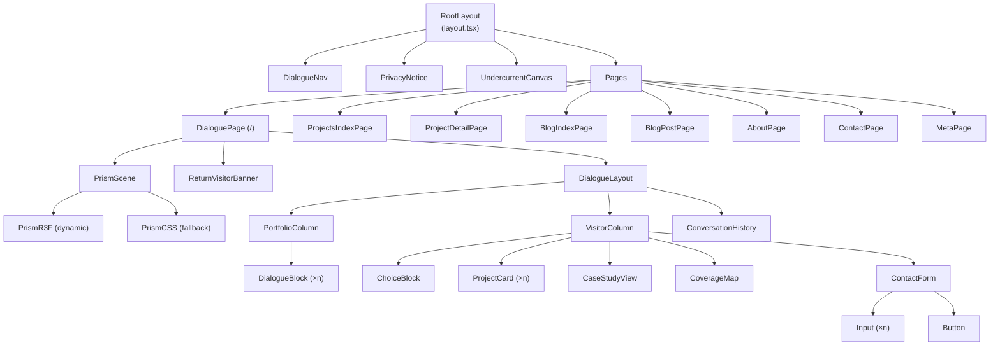

# Deliverables 13–18: Technical Architecture

---

## Deliverable 13: Folder & File Structure

### 13.1 Complete Directory Tree

```
portfolio/
├── .github/
│   ├── workflows/
│   │   ├── ci.yml                    # Main CI pipeline
│   │   └── lighthouse.yml            # Lighthouse CI on PR
│   └── dependabot.yml                # Dependency monitoring
│
├── .agents/
│   └── AGENTS.md                     # Project-scoped rules for AI agents
│
├── content/                          # All MDX content — add files here to publish
│   ├── projects/
│   │   ├── project-one.mdx           # [REPLACE: actual project slug]
│   │   ├── project-two.mdx
│   │   └── project-three.mdx
│   ├── blog/                         # Optional — Blog nav appears only if non-empty
│   ├── experiments/                  # Optional
│   ├── experience/
│   │   └── experience.mdx            # Single file, all experience entries
│   └── achievements/
│       └── achievements.mdx
│
├── public/
│   ├── fonts/                        # Self-hosted font subsets (via next/font/google)
│   ├── images/
│   │   └── projects/                 # Project screenshots/cover images
│   ├── robots.txt
│   └── favicon.ico
│
├── src/
│   ├── app/                          # Next.js App Router
│   │   ├── layout.tsx                # Root layout: theme, fonts, nav, global styles
│   │   ├── page.tsx                  # Dialogue experience entry point (/)
│   │   ├── not-found.tsx             # Custom 404
│   │   ├── error.tsx                 # Error boundary
│   │   │
│   │   ├── projects/
│   │   │   ├── page.tsx              # /projects — all projects listing
│   │   │   └── [slug]/
│   │   │       └── page.tsx          # /projects/[slug] — case study
│   │   │
│   │   ├── blog/                     # Conditionally rendered
│   │   │   ├── page.tsx              # /blog — listing
│   │   │   └── [slug]/
│   │   │       └── page.tsx          # /blog/[slug]
│   │   │
│   │   ├── experiments/
│   │   │   ├── page.tsx
│   │   │   └── [slug]/
│   │   │       └── page.tsx
│   │   │
│   │   ├── about/
│   │   │   └── page.tsx              # /about
│   │   │
│   │   ├── contact/
│   │   │   └── page.tsx              # /contact — direct contact page
│   │   │
│   │   ├── meta/
│   │   │   └── page.tsx              # /meta — self-documentation
│   │   │
│   │   ├── sitemap.ts                # Auto-generated sitemap.xml
│   │   ├── robots.ts                 # robots.txt config
│   │   │
│   │   └── api/
│   │       ├── contact/
│   │       │   └── route.ts          # POST /api/contact — Edge Runtime
│   │       └── og/
│   │           └── [...params]/
│   │               └── route.tsx     # Dynamic OG image generation — Edge Runtime
│   │
│   ├── components/
│   │   ├── atoms/                    # Atomic UI components
│   │   │   ├── Button/
│   │   │   │   ├── Button.tsx
│   │   │   │   ├── Button.module.css
│   │   │   │   └── index.ts
│   │   │   ├── Badge/
│   │   │   ├── Tag/
│   │   │   ├── Input/
│   │   │   ├── Icon/
│   │   │   └── PrivacyNotice/
│   │   │
│   │   ├── compound/                 # Compound components
│   │   │   ├── DialogueBlock/
│   │   │   │   ├── DialogueBlock.tsx
│   │   │   │   ├── DialogueBlock.module.css
│   │   │   │   └── index.ts
│   │   │   ├── ChoiceBlock/
│   │   │   ├── ProjectCard/
│   │   │   ├── CaseStudyView/
│   │   │   ├── PrismScene/
│   │   │   │   ├── PrismScene.tsx    # Wrapper with capability detection
│   │   │   │   ├── PrismR3F.tsx      # R3F implementation (dynamic import)
│   │   │   │   ├── PrismCSS.tsx      # CSS fallback
│   │   │   │   └── index.ts
│   │   │   ├── UndercurrentCanvas/
│   │   │   ├── ContactForm/
│   │   │   ├── ConversationHistory/
│   │   │   ├── CoverageMap/
│   │   │   ├── DialogueNav/
│   │   │   └── ReturnVisitorBanner/
│   │   │
│   │   └── layouts/
│   │       ├── RootLayout/
│   │       ├── DialogueLayout/
│   │       ├── ProseLayout/
│   │       └── SplitLayout/
│   │
│   ├── dialogue/                     # Dialogue tree data and engine
│   │   ├── tree.ts                   # Complete dialogue tree definition
│   │   ├── engine.ts                 # State machine: navigate, rewind, history
│   │   ├── memory.ts                 # localStorage read/write with TypeScript
│   │   └── types.ts                  # DialogueNode, DialogueChoice, DialogueMemory
│   │
│   ├── content/                      # Content layer (not MDX files — that's /content)
│   │   ├── loader.ts                 # MDX file reading, frontmatter parsing
│   │   ├── types.ts                  # Project, BlogPost, Experience, etc.
│   │   ├── projects.ts               # getAllProjects, getProject, getFeaturedProjects
│   │   ├── blog.ts                   # getAllPosts, getPost
│   │   ├── experiments.ts
│   │   └── experience.ts
│   │
│   ├── hooks/
│   │   ├── useDialogue.ts            # Dialogue engine React wrapper
│   │   ├── useDialogueMemory.ts      # localStorage hook with SSR guard
│   │   ├── useReducedMotion.ts       # prefers-reduced-motion hook
│   │   ├── useTheme.ts               # Dark/light theme management
│   │   └── useWebGL.ts               # WebGL capability detection
│   │
│   ├── lib/
│   │   ├── seo.ts                    # Metadata generation utilities
│   │   ├── structured-data.ts        # JSON-LD generation
│   │   ├── og-image.ts               # OG image template generation
│   │   ├── rate-limit.ts             # IP-based rate limiter (Edge compatible)
│   │   ├── sanitize.ts               # Input sanitization for contact form
│   │   └── utils.ts                  # Shared utility functions
│   │
│   ├── styles/
│   │   ├── globals.css               # Global styles + CSS custom properties (tokens)
│   │   ├── tokens.css                # Design token definitions (from Deliverable 10)
│   │   ├── typography.css            # Base type styles
│   │   └── reset.css                 # Modern CSS reset
│   │
│   └── types/
│       ├── content.ts                # Shared content type definitions
│       └── dialogue.ts               # Dialogue system type definitions
│
├── tests/
│   ├── unit/
│   │   ├── dialogue-engine.test.ts
│   │   ├── content-loader.test.ts
│   │   ├── rate-limiter.test.ts
│   │   └── sanitize.test.ts
│   ├── integration/
│   │   ├── dialogue-components.test.tsx
│   │   └── contact-form.test.tsx
│   └── e2e/
│       ├── dialogue-flow.spec.ts
│       ├── accessibility.spec.ts
│       └── contact-form.spec.ts
│
├── docs/
│   ├── README.md                     # Setup, run, build, test commands
│   ├── CONTENT_GUIDE.md              # How to add every content type
│   ├── DEPLOY.md                     # Deployment, environment variables
│   └── CUSTOMISE.md                  # Colors, fonts, sections, social links
│
├── .env.local.example                # Template — committed. .env.local is gitignored.
├── .npmrc                            # minimumReleaseAge=1440
├── next.config.ts
├── tsconfig.json
├── vitest.config.ts
├── playwright.config.ts
└── package.json
```

---

### 13.2 Component Hierarchy



---

### 13.3 State Management Strategy

| State Category | What Lives Here | Solution |
|---------------|-----------------|----------|
| **Server state** | All content (projects, blog, etc.) | Next.js RSC — fetched at build time, never re-fetched client-side |
| **Dialogue tree structure** | Node definitions, text, choices | Static TypeScript module — imported at build time, bundled once |
| **Dialogue session state** | Current node, conversation history, visited nodes | `useDialogue` hook — React `useReducer`, client-side only |
| **Return visitor memory** | Previous paths, coverage, visit count | `useDialogueMemory` hook — localStorage, with SSR guard (`typeof window !== 'undefined'`) |
| **Theme** | Dark/light preference | `useTheme` hook — localStorage + `<html data-theme>` attribute |
| **Undercurrent mode** | Current ambient visual state | Derived from dialogue state — passed down as prop, no separate store |
| **Form state** | Contact form fields, validation, submission | Local `useState` in `ContactForm` component |

**No external state library needed.** React's built-in `useReducer` + Context is sufficient for the dialogue engine. No Zustand, Redux, or Jotai dependency.

---

### 13.4 Rendering Strategy Per Route

| Route | Strategy | Justification |
|-------|----------|--------------|
| `/` | SSG shell + client hydration | Static HTML for fast FCP; dialogue engine hydrates client-side |
| `/projects` | SSG | Content changes only on deployment; `generateStaticParams` for all slugs |
| `/projects/[slug]` | SSG | Each case study is static; rebuilt when content changes |
| `/blog` | SSG | Rebuilt on content addition |
| `/blog/[slug]` | SSG | Same |
| `/experiments` | SSG | Same |
| `/experiments/[slug]` | SSG | Same |
| `/about` | SSG | Personal content rarely changes |
| `/contact` | SSG + client | Form is client-only; page is static |
| `/meta` | SSG | Self-documentation is static |
| `/api/contact` | Edge Runtime | Low-latency, no Node.js runtime needed for form handler |
| `/api/og/[...params]` | Edge Runtime | Dynamic image generation per request, globally fast |
| `sitemap.ts` | SSG (auto) | Built by Next.js at build time from content |

---

## Deliverable 14: Content Architecture

### 14.1 MDX Processing Pipeline

```
/content/projects/my-project.mdx
         │
         │ (at build time)
         ▼
src/content/loader.ts
  fs.readFileSync(filepath)
  gray-matter.parse()        → { data: frontmatter, content: mdxString }
  validateFrontmatter()      → type-safe, throws on missing required fields
  compileMDX()               → (next-mdx-remote) serialized MDX
  enrichMetadata()           → auto-generate missing optional fields
         │
         ▼
Type-safe Project object → used in:
  - generateStaticParams()   (build: enumerate slugs)
  - page.tsx                 (render: pass to component)
  - sitemap.ts               (build: add to sitemap)
  - seo.ts                   (build: generate metadata)
  - search-index.ts          (build: add to search index)
  - dialogue/tree.ts         (runtime: content refs resolved)
```

### 14.2 TypeScript Frontmatter Schemas

```typescript
// src/types/content.ts

export interface Project {
  // Required
  slug: string;              // Derived from filename (my-project.mdx → my-project)
  title: string;
  description: string;
  tags: string[];
  tech: string[];
  featured: boolean;
  date: string;              // ISO date string: "2024-03-15"
  problem: string;
  solution: string;
  architecture: string;
  results: string;
  // Optional — layout never breaks without these
  liveUrl?: string;
  githubUrl?: string;
  coverImage?: string;       // Relative path from /public/images/projects/
  metrics?: string;
  challenges?: string;
  // Auto-generated if missing
  seoTitle?: string;         // Falls back to title
  seoDescription?: string;   // Falls back to description (truncated to 160 chars)
  ogImage?: string;          // Falls back to dynamic /api/og/project/[slug]
}

export interface BlogPost {
  slug: string;
  title: string;
  excerpt: string;
  tags: string[];
  date: string;
  // Optional
  coverImage?: string;
  seoTitle?: string;
  seoDescription?: string;
  ogImage?: string;
}

export interface Experience {
  company: string;           // Required
  role: string;              // Required
  startDate: string;         // Required — "YYYY-MM"
  endDate: string;           // Required — "YYYY-MM" or "present"
  description: string;       // Required
  highlights: string[];      // Required
  // Optional
  logo?: string;
  url?: string;
}

export interface Experiment {
  slug: string;
  title: string;
  description: string;
  tags: string[];
  tech: string[];
  date: string;
  // Optional
  liveUrl?: string;
  githubUrl?: string;
  coverImage?: string;
}

export interface Achievement {
  title: string;
  description: string;
  date: string;
  // Optional
  url?: string;
  icon?: string;
}
```

### 14.3 Auto-Categorization System

When an MDX file is added to `/content/`, the following is auto-generated at build time. **Zero manual configuration needed.**

```typescript
// src/content/loader.ts (simplified)

function enrichMetadata(raw: RawFrontmatter, slug: string): EnrichedContent {
  return {
    ...raw,
    slug,
    // Auto-generate SEO title if not provided
    seoTitle: raw.seoTitle ?? `${raw.title} | [REPLACE: Developer Name]`,
    // Auto-generate SEO description if not provided
    seoDescription: raw.seoDescription
      ?? raw.description.slice(0, 155) + (raw.description.length > 155 ? '…' : ''),
    // Auto-generate OG image path if not provided
    ogImage: raw.ogImage ?? `/api/og/${contentType}/${slug}`,
    // Auto-tag based on tech array (normalize, dedupe)
    tags: dedupeAndNormalize([...raw.tags, ...inferTagsFromTech(raw.tech)]),
    // Format dates
    dateFormatted: formatDate(raw.date),
  };
}

// Tech → auto-tag inference
function inferTagsFromTech(tech: string[]): string[] {
  const map: Record<string, string[]> = {
    'react':       ['frontend', 'ui'],
    'next.js':     ['frontend', 'fullstack'],
    'node.js':     ['backend'],
    'postgresql':  ['backend', 'database'],
    'typescript':  ['engineering'],
    // ... extensible map
  };
  return tech.flatMap(t => map[t.toLowerCase()] ?? []);
}
```

### 14.4 Content-Driven Navigation

**Blog nav link appears only if blog posts exist**:

```typescript
// src/app/layout.tsx (RSC)
import { getAllPosts } from '@/content/blog';

const posts = await getAllPosts();
const showBlogLink = posts.length > 0;

// Passed to DialogueNav as: showBlogLink={showBlogLink}
```

This check runs at build time. If the `/content/blog/` directory is empty, the nav link is never rendered. No manual configuration.

### 14.5 Sitemap Auto-Generation

```typescript
// src/app/sitemap.ts
import type { MetadataRoute } from 'next';
import { getAllProjects } from '@/content/projects';
import { getAllPosts } from '@/content/blog';

export default async function sitemap(): Promise<MetadataRoute.Sitemap> {
  const projects = await getAllProjects();
  const posts = await getAllPosts();
  const baseUrl = process.env.NEXT_PUBLIC_SITE_URL!;

  return [
    { url: baseUrl,                   lastModified: new Date(), changeFrequency: 'weekly',  priority: 1.0 },
    { url: `${baseUrl}/projects`,     lastModified: new Date(), changeFrequency: 'monthly', priority: 0.9 },
    { url: `${baseUrl}/about`,        lastModified: new Date(), changeFrequency: 'monthly', priority: 0.8 },
    { url: `${baseUrl}/contact`,      lastModified: new Date(), changeFrequency: 'yearly',  priority: 0.7 },
    { url: `${baseUrl}/meta`,         lastModified: new Date(), changeFrequency: 'monthly', priority: 0.6 },
    ...projects.map(p => ({
      url: `${baseUrl}/projects/${p.slug}`,
      lastModified: new Date(p.date),
      changeFrequency: 'monthly' as const,
      priority: 0.85,
    })),
    ...posts.map(p => ({
      url: `${baseUrl}/blog/${p.slug}`,
      lastModified: new Date(p.date),
      changeFrequency: 'monthly' as const,
      priority: 0.7,
    })),
  ];
}
```

### 14.6 RSS Feed Auto-Generation

```typescript
// src/app/rss.xml/route.ts
// Auto-generates RSS feed from all blog posts + projects
// Served at /rss.xml
```

Content added → build runs → sitemap and RSS update automatically. No manual steps.

---

## Deliverable 15: SEO Architecture

### 15.1 generateMetadata() Per Route

```typescript
// Pattern used on EVERY page:

// src/app/projects/[slug]/page.tsx
export async function generateMetadata({ params }: Props): Promise<Metadata> {
  const project = await getProject(params.slug);
  const siteUrl = process.env.NEXT_PUBLIC_SITE_URL!;

  return {
    title: project.seoTitle,
    description: project.seoDescription,
    canonical: `${siteUrl}/projects/${project.slug}`,
    openGraph: {
      title: project.seoTitle,
      description: project.seoDescription,
      url: `${siteUrl}/projects/${project.slug}`,
      type: 'article',
      images: [{ url: project.ogImage, width: 1200, height: 630 }],
    },
    twitter: {
      card: 'summary_large_image',
      title: project.seoTitle,
      description: project.seoDescription,
      images: [project.ogImage],
    },
  };
}
```

### 15.2 JSON-LD Structured Data

Every page injects `<script type="application/ld+json">` in the `<head>`.

**Root page (`/`)** — `Person` + `WebSite`:
```json
{
  "@context": "https://schema.org",
  "@graph": [
    {
      "@type": "Person",
      "@id": "[REPLACE: siteUrl]/#person",
      "name": "[REPLACE: Developer Full Name]",
      "jobTitle": "[REPLACE: Job Title]",
      "url": "[REPLACE: siteUrl]",
      "sameAs": [
        "[REPLACE: LinkedIn URL]",
        "[REPLACE: GitHub URL]",
        "[REPLACE: Twitter URL]"
      ]
    },
    {
      "@type": "WebSite",
      "@id": "[REPLACE: siteUrl]/#website",
      "name": "[REPLACE: Developer Name] — Portfolio",
      "url": "[REPLACE: siteUrl]",
      "author": { "@id": "[REPLACE: siteUrl]/#person" }
    }
  ]
}
```

**Project pages** — `CreativeWork` + `BreadcrumbList`:
```json
{
  "@type": "CreativeWork",
  "name": "[project.title]",
  "description": "[project.description]",
  "author": { "@id": "[REPLACE: siteUrl]/#person" },
  "dateCreated": "[project.date]",
  "url": "[siteUrl]/projects/[slug]"
}
```

**Blog pages** — `Article` + `BreadcrumbList`:
```json
{
  "@type": "Article",
  "headline": "[post.title]",
  "description": "[post.excerpt]",
  "author": { "@id": "[REPLACE: siteUrl]/#person" },
  "datePublished": "[post.date]",
  "url": "[siteUrl]/blog/[slug]"
}
```

### 15.3 Dynamic OG Image Generation

```typescript
// src/app/api/og/[...params]/route.tsx
// Edge Runtime — renders ImageResponse for every content type

// URL patterns:
// /api/og/project/[slug]   → project OG image
// /api/og/blog/[slug]      → blog post OG image
// /api/og/page/[page]      → generic page OG image

export const runtime = 'edge';

export async function GET(request: Request, { params }: Params) {
  // Renders: Developer Name + page/project title + accent accent bar
  // Uses: Playfair Display for title, DM Sans for name
  // Fonts are loaded as ArrayBuffer for edge compatibility
  // Output: 1200×630 PNG via ImageResponse
}
```

### 15.4 SEO Rules Checklist

| Rule | Implementation |
|------|---------------|
| One `<h1>` per page | Enforced in component structure; linted |
| Unique `<title>` per page | `generateMetadata()` on every route |
| Unique `meta description` | `generateMetadata()` on every route |
| All pages indexable | `robots.ts` allows all; no accidental `noindex` |
| Canonical URLs | Set in `generateMetadata()` on every page |
| Image `alt` text | Required field in Project schema; linted |
| Semantic HTML | `<main>`, `<nav>`, `<header>`, `<footer>`, `<article>`, `<section>` |
| Dialogue SEO | Server-renders default path (no `?path=` param); crawlers see full content |
| Blog nav conditional | Nav link in structured data only if posts exist |

### 15.5 robots.txt

```
# src/app/robots.ts
export default function robots(): MetadataRoute.Robots {
  return {
    rules: { userAgent: '*', allow: '/' },
    sitemap: `${process.env.NEXT_PUBLIC_SITE_URL}/sitemap.xml`,
  };
}
```

---

## Deliverable 16: Accessibility Architecture

### 16.1 Standards Target

- **Minimum**: WCAG 2.1 AA on all pages and interactions
- **Target**: WCAG 2.1 AAA for text contrast and focus management
- **Testing**: Automated with axe-core (zero critical violations target) + manual with keyboard + NVDA/VoiceOver

### 16.2 Keyboard Navigation — Dialogue Interface

**Complete keyboard flow**:

```
Tab           → Cycle through all focusable elements (choices, links, nav)
Shift+Tab     → Reverse cycle
Enter / Space → Select focused choice
Backspace /   
Escape        → Rewind to previous dialogue node
1 / 2 / 3... → Select choice by index (shortcut hint displayed on each choice)
H             → Open/close conversation history panel
C             → Jump to contact (from any node)
M             → Jump to meta (from any node)
?             → Show keyboard shortcuts help modal
```

**Focus trap during modals** (conversation history panel, shortcuts help): Focus cycles only within the modal. Escape closes it and returns focus to the trigger element.

### 16.3 Focus Management on Branch Navigation

When the user selects a choice:
1. Selected choice receives `aria-pressed="true"` briefly
2. Other choices fade out
3. New `DialogueBlock` animates in
4. Focus moves to the new `ChoiceBlock`'s first option automatically (via `focus()` call after animation completes)
5. Screen reader receives: `aria-live="polite"` region announces the new portfolio statement

```typescript
// In useDialogue hook:
function selectChoice(choiceId: string) {
  dispatch({ type: 'SELECT', choiceId });
  // After animation settles (--duration-slow = 500ms):
  setTimeout(() => {
    choiceBlockRef.current?.querySelector('[role="button"]')?.focus();
  }, 520);
}
```

### 16.4 ARIA Implementation Plan

```html
<!-- Dialogue container -->
<main role="main" aria-label="Portfolio dialogue">

  <!-- Live region — announces new portfolio statements -->
  <div aria-live="polite" aria-atomic="true" class="sr-only" id="dialogue-announcer">
    [Portfolio statement text injected here on each new node]
  </div>

  <!-- Portfolio column -->
  <div role="region" aria-label="Portfolio message">
    <DialogueBlock />
  </div>

  <!-- Visitor column -->
  <div role="region" aria-label="Your choices">
    <ChoiceBlock role="group" aria-label="Choose your path" />
  </div>

  <!-- Conversation history -->
  <nav aria-label="Conversation history" role="navigation">
    <!-- history items -->
  </nav>

</main>

<!-- Persistent nav -->
<nav aria-label="Main navigation">
  <button aria-label="Go back one step" aria-disabled={!canGoBack} />
  <button aria-label="Start conversation over" />
</nav>
```

### 16.5 Color Contrast Verification

All text/background pairs verified against WCAG standards:

| Pair | Ratio | Standard |
|------|-------|---------|
| `--color-text-primary` on `--color-bg-base` (`#f0f0f2` on `#0e0e10`) | ~15.5:1 | ✅ AAA |
| `--color-text-secondary` on `--color-bg-base` (`#9494a0` on `#0e0e10`) | ~5.7:1 | ✅ AA |
| `--color-text-accent` on `--color-bg-base` (`#c084fc` on `#0e0e10`) | ~5.2:1 | ✅ AA |
| Choice block text on `--color-bg-surface-1` | ~14.8:1 | ✅ AAA |
| Portfolio voice text on `--color-bg-base` | ~15.5:1 | ✅ AAA |

**Undercurrent opacity rule**: The undercurrent layer is capped at 12% opacity maximum. Text color contrast is measured against the composite background (base + undercurrent). All pairings remain AA compliant even at maximum undercurrent opacity.

### 16.6 Touch Target Sizes

| Element | Min Size | Implementation |
|---------|----------|---------------|
| Choice blocks | 48×48px min | `min-height: 48px`, full-width on mobile |
| Nav buttons | 44×44px | Padding applied to achieve target |
| Back arrow | 44×44px | Padding around icon |
| Form inputs | 44px height | `padding: var(--space-3) var(--space-4)` |
| External links | 24px min line-height | Inline links have `padding: 2px 0` |

### 16.7 3D Prism Accessibility

The PrismScene canvas:
- `aria-hidden="true"` — purely decorative, never conveys information
- `role="presentation"` on the canvas element
- All portfolio content (name, tagline, choices) are DOM elements **adjacent to** the canvas, never inside it
- Without the prism (CSS fallback, screen reader mode, reduced-motion): experience is identical — same text, same choices, prism is just visual decoration

---

## Deliverable 17: Security Architecture & Threat Model

### 17.1 Threat Model

| Threat | Surface | Mitigation |
|--------|---------|-----------|
| **XSS** | MDX content rendering, contact form display | MDX sanitized via `next-mdx-remote`'s built-in escaping; contact form messages never rendered as HTML |
| **CSRF** | Contact form API endpoint | Edge Runtime form handler validates `Origin` header; SameSite cookie policy (no cookies used) |
| **SSRF** | None — no server-to-server requests in this app | N/A (no external URL fetching in API routes) |
| **Injection** | Contact form fields | Server-side input sanitization (strip HTML tags, trim whitespace, validate email format regex) |
| **Content poisoning** | MDX files | MDX files live in the repo — only repo contributors can modify. No CMS API endpoint. |
| **Prompt injection** | None — no AI processing of user input | N/A |
| **Supply chain** | npm packages | `.npmrc` minimumReleaseAge=1440; pinned exact versions; Dependabot monitoring |
| **Data leakage** | Environment variables | `.env.local` gitignored; only server components access `process.env.*`; no secrets in client bundle |
| **localStorage** | Dialogue memory | Contains only visit metadata (no PII, no sensitive data). Clear mechanism always visible. |
| **Rate limiting abuse** | `/api/contact` | Max 5 submissions per IP per hour — enforced at Edge Runtime |
| **Verbose errors** | API responses | All API errors return generic messages to client; detailed errors logged server-side only |

### 17.2 Security Headers

Applied in `next.config.ts` via `headers()`:

```typescript
const securityHeaders = [
  {
    key: 'Content-Security-Policy',
    value: [
      "default-src 'self'",
      "script-src 'self' 'unsafe-eval'",    // 'unsafe-eval' for Three.js GLSL shader compilation — justified
      "style-src 'self' 'unsafe-inline' https://fonts.googleapis.com",  // Google Fonts CSS
      "font-src 'self' https://fonts.gstatic.com",
      "img-src 'self' data: blob:",          // blob: for Three.js canvas
      "connect-src 'self'",
      "frame-src 'none'",
      "object-src 'none'",
      "base-uri 'self'",
    ].join('; '),
  },
  { key: 'X-Frame-Options',           value: 'DENY' },
  { key: 'X-Content-Type-Options',    value: 'nosniff' },
  { key: 'Referrer-Policy',           value: 'strict-origin-when-cross-origin' },
  { key: 'Permissions-Policy',        value: 'camera=(), microphone=(), geolocation=()' },
  { key: 'X-DNS-Prefetch-Control',    value: 'on' },
];
```

**Note on `unsafe-eval`**: Three.js requires `unsafe-eval` for GLSL shader compilation. This is scoped to `script-src` only. If the prism is removed in a future version, this can be dropped.

**Note on `unsafe-inline` for styles**: Required for CSS-in-JS and inline styles used by Next.js App Router. Scoped to `style-src` only.

### 17.3 Secrets Management

```
# .env.local (gitignored — never committed)
CONTACT_EMAIL_TO=[REPLACE: delivery email for contact form submissions]
CONTACT_RATE_LIMIT_SECRET=[REPLACE: secret for rate limit store]
NEXT_PUBLIC_SITE_URL=[REPLACE: production URL e.g. https://yourname.dev]
```

**Rules**:
- `NEXT_PUBLIC_*` variables are safe for client bundles (they're public by design)
- `CONTACT_EMAIL_TO` and secrets: only accessed in Edge Runtime API routes, never in `'use client'` components
- `.env.local.example` is committed with placeholder values as documentation
- Vercel environment variables configured in Vercel dashboard, not in committed files

### 17.4 Contact Form Security

```typescript
// src/app/api/contact/route.ts

export const runtime = 'edge';

export async function POST(request: Request) {
  // 1. Rate limiting — before any processing
  const ip = request.headers.get('x-forwarded-for') ?? 'unknown';
  const allowed = await checkRateLimit(ip, { maxRequests: 5, windowHours: 1 });
  if (!allowed) {
    return Response.json({ error: 'Too many requests. Please try again later.' }, { status: 429 });
  }

  // 2. Parse body
  const body = await request.json().catch(() => null);
  if (!body) return Response.json({ error: 'Invalid request.' }, { status: 400 });

  // 3. Sanitize all fields
  const name    = sanitize(body.name,    { maxLength: 100 });
  const email   = sanitize(body.email,   { maxLength: 254 });
  const message = sanitize(body.message, { maxLength: 2000 });
  const context = sanitize(body.context, { maxLength: 500 });

  // 4. Validate
  if (!name || !email || !message) {
    return Response.json({ error: 'Required fields missing.' }, { status: 400 });
  }
  if (!isValidEmail(email)) {
    return Response.json({ error: 'Invalid email address.' }, { status: 400 });
  }
  if (message.length < 20) {
    return Response.json({ error: 'Message too short.' }, { status: 400 });
  }

  // 5. Send (e.g., via Resend API or nodemailer — no credential in client)
  // ... server-only email sending

  // 6. Generic success response (never expose server details)
  return Response.json({ success: true });
}
```

### 17.5 Security Checklist

- [ ] `.env.local` in `.gitignore`
- [ ] `.env.local.example` committed with placeholders
- [ ] All security headers applied in `next.config.ts`
- [ ] Contact form rate limited (5/IP/hour)
- [ ] Contact form server-validated (never trust client)
- [ ] Input sanitization on all form fields
- [ ] No `any` TypeScript types (prevents injection via type unsafety)
- [ ] MDX rendered via `next-mdx-remote` (no `dangerouslySetInnerHTML` with unsanitized content)
- [ ] `localStorage` contains no PII
- [ ] No secrets in `NEXT_PUBLIC_*` variables
- [ ] CSP headers applied
- [ ] `X-Frame-Options: DENY` (prevents clickjacking)
- [ ] `package-lock.json` committed
- [ ] `.npmrc` minimumReleaseAge=1440 set
- [ ] Dependabot configured
- [ ] All API routes return generic errors to client

---

## Deliverable 18: Performance Architecture

### 18.1 Lighthouse 95+ Strategy

**Homepage (/)** — most complex page, highest stakes:

| Metric | Target | Strategy |
|--------|--------|---------|
| Performance | 98+ | Typography-first; no blocking resources; RSC streaming |
| Accessibility | 98+ | Full ARIA implementation from Deliverable 16 |
| SEO | 100 | Complete metadata, JSON-LD, one h1, canonical |
| Best Practices | 100 | HTTPS, no deprecated APIs, console-clean |

### 18.2 Core Web Vitals

| Metric | Target | Why Achievable |
|--------|--------|---------------|
| **LCP** | < 1.2s | LCP element is text (name + tagline) — renders on first paint, no image blocking |
| **TTI** | < 2.0s | Minimal client JS; dialogue engine is small; R3F loaded dynamically |
| **CLS** | < 0.02 | Explicit height on prism canvas; font display: swap with `size-adjust`; no layout-shifting ads |
| **INP** | < 100ms | Choice selections are instant state updates; no heavy computations on interaction |

### 18.3 JavaScript Bundle Budget

**Homepage initial JS** (target: < 250KB compressed):

| Chunk | Estimated Size (compressed) |
|-------|----------------------------|
| Next.js framework runtime | ~45KB |
| React + ReactDOM | ~42KB |
| Dialogue engine + tree data | ~8KB |
| Core components (DialogueBlock, ChoiceBlock, Nav) | ~12KB |
| GSAP core (no plugins in initial bundle) | ~18KB |
| Framer Motion (deferred, loaded after hydration) | ~25KB |
| Fonts (inline critical, rest via preload) | ~0KB in JS |
| **Initial bundle total** | **~150KB** |
| **Budget headroom** | **100KB remaining** |

**Heavy chunks — all dynamically imported**:

| Chunk | Load Trigger | Estimated Size |
|-------|-------------|----------------|
| React Three Fiber | User has WebGL + no reduced-motion | ~65KB |
| Three.js core | Same as R3F | ~120KB |
| @react-three/drei | Same as R3F | ~35KB |
| GSAP ScrollTrigger | When dialogue layout mounts | ~15KB |
| GSAP SplitText | When DialogueBlock mounts | ~12KB |

R3F is loaded only on capable desktop devices. On mobile, the PrismCSS component loads instead (0KB extra JS).

### 18.4 Dynamic Import Strategy

```typescript
// PrismScene — never in initial bundle
const PrismR3F = dynamic(() => import('./PrismR3F'), {
  ssr: false,
  loading: () => <PrismCSS />,  // CSS fallback shows during R3F load
});

// CaseStudyView — loaded only when a project is opened
const CaseStudyView = dynamic(() => import('@/components/compound/CaseStudyView'), {
  ssr: false,
  loading: () => <CaseStudySkeleton />,
});

// ConversationHistory panel — loaded on first open
const ConversationHistory = dynamic(
  () => import('@/components/compound/ConversationHistory'),
  { ssr: false }
);
```

### 18.5 Image Optimization

All images use `next/image`:

```typescript
<Image
  src={project.coverImage}
  alt={project.imageAlt}      // Required field in schema
  width={800}
  height={450}
  sizes="(max-width: 768px) 100vw, (max-width: 1200px) 50vw, 800px"
  priority={isAboveFold}      // true only for first visible project
  placeholder="blur"
  blurDataURL={project.blurDataURL}  // Generated at build time
  quality={85}
/>
```

- Format: AVIF (primary), WebP (fallback), JPEG (last resort) — auto-negotiated by Next.js
- Explicit width/height: always set — eliminates CLS from images
- `priority`: only the first above-fold image; all others lazy-load
- Blur placeholder: prevents layout shift during load

### 18.6 Suspense Boundaries

```typescript
// app/page.tsx (RSC shell)
export default function Home() {
  return (
    <main>
      <Suspense fallback={<PrismSkeleton />}>
        <DialoguePage />              {/* Client component — hydrates progressively */}
      </Suspense>
    </main>
  );
}

// app/projects/[slug]/page.tsx
export default async function ProjectPage({ params }) {
  const project = await getProject(params.slug);  // Awaited in RSC, no client waterfall
  return (
    <ProseLayout>
      <Suspense fallback={<CaseStudySkeleton />}>
        <CaseStudyView project={project} variant="standalone" />
      </Suspense>
    </ProseLayout>
  );
}
```

### 18.7 3D Performance Budget

**Target**: 60 FPS on desktop, never below 45 FPS.

**Prism budget**:
- Canvas size: 220×220px (tiny — 5% of typical viewport)
- Geometry: IcosahedronGeometry with 2 subdivisions = ~320 triangles (negligible)
- Material: MeshTransmissionMaterial with `samples={4}` (reduced from default 10)
- Frame rate: Capped at 30 FPS for the prism (24 FPS is sufficient for a slowly-rotating crystal) using `frameloop="demand"` + manual invalidation
- DPR: `dpr={[1, 1.5]}` — never renders at full 2× or 3× retina for 3D canvas

**Mobile triggers for CSS fallback**:
```typescript
const usePrismFallback = () => {
  if (typeof window === 'undefined') return true;
  if (!window.WebGLRenderingContext) return true;       // No WebGL support
  if (window.matchMedia('(pointer: coarse)').matches) return true;  // Touch device
  if (window.matchMedia('(prefers-reduced-motion: reduce)').matches) return true;
  // Memory heuristic — low-end devices
  if ((navigator as any).deviceMemory && (navigator as any).deviceMemory < 4) return true;
  return false;
};
```

### 18.8 Edge Runtime Strategy

```typescript
// API routes on Edge Runtime — globally distributed, fast cold start
export const runtime = 'edge';

// /api/contact — Edge: fast form handling, no Node.js needed
// /api/og/[...params] — Edge: image generation near the user
```

Static pages (all content pages): served from Vercel Edge Network CDN — no runtime cost.

### 18.9 Performance Monitoring

- **Vercel Analytics**: Built-in Core Web Vitals monitoring — no extra package needed
- **Lighthouse CI**: Run in GitHub Actions on every PR; block merge if scores drop below 90
- **Bundle analyzer**: `@next/bundle-analyzer` — run manually before releases to audit bundle growth
